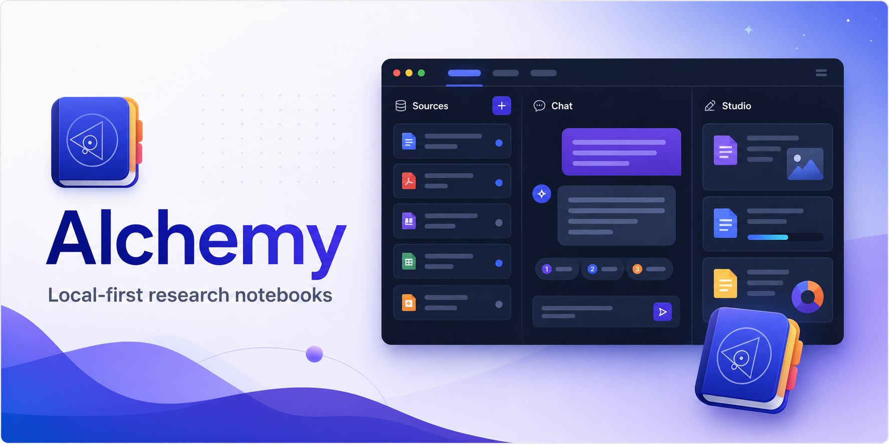
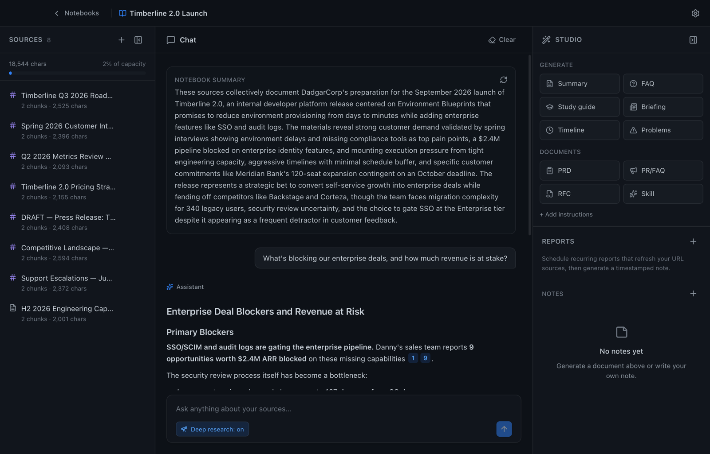
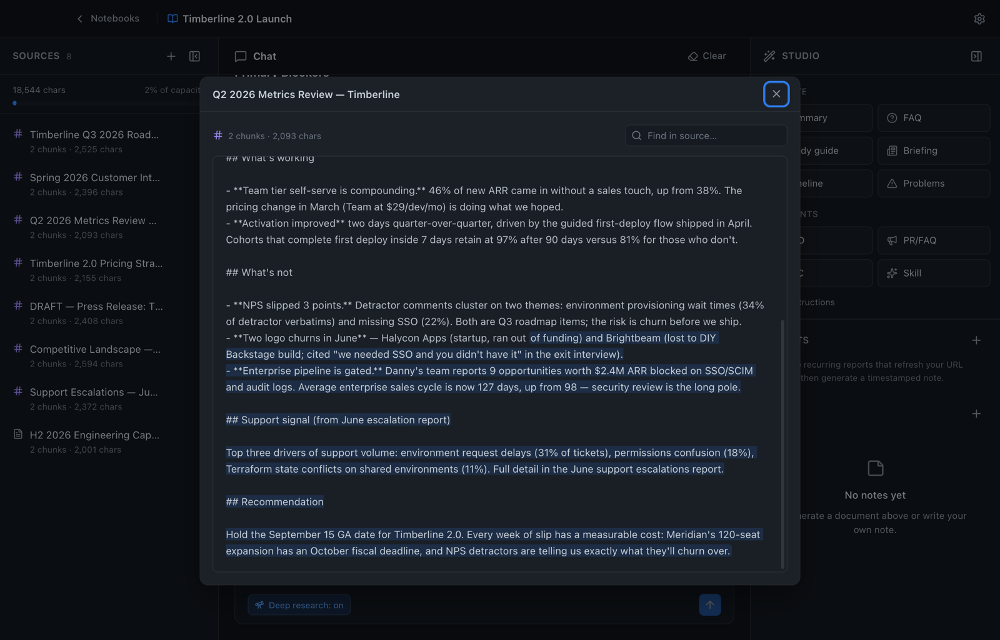

# Alchemy

A local-first, privacy-respecting desktop app inspired by
[NotebookLM](https://notebooklm.google/). Import your sources, chat with them
grounded in citations, and generate documents — all running **100% on your
machine** via [Ollama](https://ollama.com). No API keys, no cloud, nothing
leaves your laptop.

Prefer a cloud LLM (or can't run local models)? Alchemy also routes chat through
any OpenAI-compatible gateway — while keeping your sources on-device via a
built-in embedder. See
[Using a cloud LLM](#using-a-cloud-llm-any-openai-compatible-gateway).

> Built with **Tauri 2 + React** front-end, a **Rust** backend, **LanceDB** for
> embedded vector + relational storage, and a **Linear-inspired** UI with 12 themes.

[](https://github.com/thrashr888/alchemy/actions/workflows/ci.yml)



<details>
<summary>Click a citation to open the source, scrolled to the exact passage</summary>



</details>

---

## Features

- **Notebooks** — a home screen of notebooks (most-recent first); opens to your last one.
- **Sources** — import **PDF**, **Office** (`.docx` / `.pptx` / `.xlsx`), **CSV/TSV**,
  **images**, **text**, **Markdown**, paste text, or fetch a **URL** — including
  link-shared **Google Docs, Sheets, and Slides** (paste the link, or drag the
  `.gdoc` / `.gsheet` / `.gslides` files from a local Google Drive folder). Each is
  extracted, chunked, and embedded locally. Drag-and-drop onto the Sources panel.
  File sources remember their on-disk path — **Refresh** re-reads a changed file
  (and URL sources re-fetch); **Show in Finder** jumps to the original.
  Failed/blocked imports show an error badge and can be retried; edited/refreshed
  sources are re-embedded.
- **Command menu** — press **⌘K** anywhere to search notebooks, add sources, generate
  documents, toggle panels, and switch themes.
- **OCR** — image sources and scanned/image-only PDFs are transcribed by a local
  vision model (dedicated OCR models like `glm-ocr` / `deepseek-ocr` recommended).
- **Grounded chat** — streamed answers that cite the exact source passages they drew
  from, with a **"Deep research"** agentic mode that plans multiple retrieval steps.
  Copy a response or save it as a note.
- **Select-to-ask** — highlight any passage in the source reader to **Explain** it,
  **Compare** it against your other sources, or stage it in the chat composer with
  your own question.
- **Studio generators** — one-click **Summary**, **FAQ**, **Study guide**, **Briefing**,
  **Timeline**, **Insights** (cross-source connections, contradictions & surprises),
  **Data table**, **Problems** (finds errors/gaps/contradictions), **Flashcards** and
  **Quiz** for learning, plus HashiCorp-style **PRD**, **PR/FAQ**, **RFC**, and a
  **Skill** (SKILL.md) generator. Add custom instructions, and **rebuild** any
  document against the latest sources.
- **Notes** — a **WYSIWYG** editor (Markdown under the hood), copy to clipboard, and
  **Convert to source** to fold a note into the retrievable source set.
- **Periodic reports** — schedule a notebook to refresh its URL sources and generate a
  timestamped report note on an interval.
- **Model tooling** — live chat/embed **health check**, per-model **tokens/sec**
  tracking, MLX-accelerated model suggestions, and safe **re-embed-on-model-switch**.
- **12 themes** — Midnight, Light, Slate, Dracula, Monokai, GitHub, Solarized,
  Tokyo Night, Claude, OpenAI, Catppuccin Latte, Sepia.

## Architecture

```
┌──────────────────────────────── Tauri window ────────────────────────────────┐
│  React + Tailwind                                                            │
│  Home (notebook picker)  |  Sources │ Chat (streaming) │ Studio (docs+notes) │
└───────────────────────────────── IPC (invoke / events) ──────────────────────┘
                                     │
┌───────────────────────────────── Rust backend ───────────────────────────────┐
│  commands.rs   Tauri command surface + per-model stats                       │
│  ingest.rs     extract (pdf/office/url/text) → normalize → structure-aware   │
│                chunking (paragraphs/headings, title+section context prefix)  │
│  pdf.rs        PDFium page rasterization for scanned-PDF OCR                 │
│  ai/ollama.rs  embeddings, streaming chat, OCR over Ollama HTTP              │
│  agent.rs      agentic "deep research" retrieval loop                        │
│  rag.rs        retrieval prompt assembly + generator prompts                 │
│  db.rs         LanceDB tables: notebooks, sources, chunks(+vectors+FTS),     │
│                messages, notes, report_schedules; hybrid search (RRF)        │
└──────────────────────────────────────────────────────────────────────────────┘
                                     │
                              Ollama (localhost:11434)
```

The RAG loop: a question is embedded and the `chunks` table is searched two
ways — vector similarity (finds paraphrases) and BM25 full-text (finds exact
names, codes, and numbers that embeddings miss) — with the two result lists
merged by reciprocal rank fusion. Chunks are structure-aware: whole paragraphs
packed to ~280 words, headings kept with their sections, and each chunk is
embedded with a `[Doc title › Section]` context prefix (the stored text stays
verbatim so citation highlighting still works). The top passages become
numbered excerpts in the prompt, and the model answers with `[n]` citations
that map back to the retrieved chunks shown in the UI.
See [docs/ARCHITECTURE.md](docs/ARCHITECTURE.md).

### Deep-research (agent mode) loop

In agent mode (`agent.rs`), the model plans its own retrieval before answering.
Each step it emits one JSON action; evidence accumulates until it decides it
has enough:

```
User question
      │
      ▼
┌─ Planner loop (≤5 steps, one JSON action per step) ──────────────────────────┐
│                                                                              │
│  "search <query>"  hybrid search (vector + BM25, RRF) → top-20 pool          │
│                        │                                                     │
│                        ▼  rerank (one model call)                            │
│                    the ≤5 passages that actually answer ─► evidence pool     │
│                    180-char snippets ─────────────────────► transcript       │
│                                                                              │
│  "read <source>"   fetch full text (shared budget:                           │
│                    120k chars gateway / 12k local)                           │
│                        │                                                     │
│                        ▼  sub-read (one model call)                          │
│                    distill against the question into                         │
│                    verbatim quotes (≤4k chars) ───────► evidence pool        │
│                    same distillate ───────────────────► transcript           │
│                                                                              │
│  "answer"          enough evidence — exit loop                               │
│                                                                              │
│  The transcript (searches + distilled reads so far) is re-sent to the        │
│  planner each step so it can decide what's still missing.                    │
└──────────────────────────────────────────────────────────────────────────────┘
      │  fallback: nothing gathered → direct top-8 vector search
      ▼
┌─ Writer (one streamed call) ─────────────────────────────────────────────────┐
│  grounding rules + persona  │  last 6 chat turns  │  full source manifest    │
│  numbered excerpts [1..n] from the evidence pool                             │
│                └─► streamed answer citing [n], mapped back to sources        │
└──────────────────────────────────────────────────────────────────────────────┘
      │
      ▼
Persisted message — citation snippets are the distilled verbatim quotes, so
the excerpts shown in the UI are exactly what the writer saw, and clicking a
citation highlights real passages in the source.
```

Because a read returns distilled evidence rather than raw text, the writer's
context stays small no matter how many or how large the read documents are —
the read budget bounds each sub-read call, not the final prompt.

Studio generators and scheduled reports share the retrieval improvements too:
they build their corpus by budgeting fairly across all sources (waterfill),
and any source that exceeds its allocation gets the same distillation
treatment — the overflow is distilled against the generation instructions and
appended, so a big source contributes its relevant passages instead of losing
everything past the cut.

## Install (Apple Silicon)

Download the latest `Alchemy_x.y.z_aarch64.dmg` from
[Releases](https://github.com/thrashr888/alchemy/releases), open it, and drag
**Alchemy** to Applications. Builds are **signed with a Developer ID and
notarized by Apple**, so they open with a normal double-click.

Requires [Ollama](https://ollama.com) running locally.

## Prerequisites (development)

- **[Ollama](https://ollama.com)** running locally (`ollama serve`).
- Models pulled — for example:

  ```bash
  ollama pull nomic-embed-text        # embeddings
  ollama pull gpt-oss:120b            # chat (or any chat model)
  ollama pull glm-ocr                 # OCR (optional, for images / scanned PDFs)
  ```

- **Rust** (stable) and **Node** with **pnpm**. `protoc` is required to build
  LanceDB (`brew install protobuf`).
- The PDFium library (for scanned-PDF OCR) is **fetched automatically on first
  build** by [`scripts/fetch-pdfium.sh`](scripts/fetch-pdfium.sh) (via `build.rs`);
  no manual step needed.

## Develop

```bash
pnpm install
pnpm tauri dev
```

The first build compiles LanceDB and is slow; subsequent builds are fast.

## Test & lint

```bash
cd src-tauri
cargo test          # unit tests (+ a graceful-skip Ollama integration test)
cargo fmt -- --check
cargo clippy --all-targets -- -D warnings
```

CI ([.github/workflows/ci.yml](.github/workflows/ci.yml)) runs the frontend
typecheck/build plus the above on every push and PR.

## Configuration

Open **Settings** (gear icon) to set the Ollama URL and choose models. Defaults:

| Setting          | Default                    |
| ---------------- | -------------------------- |
| Ollama URL       | `http://localhost:11434`   |
| Chat model       | `gpt-oss:120b`             |
| Embedding model  | `nomic-embed-text:latest`  |
| Vision model     | _(unset — OCR disabled)_   |

Switching the embedding model prompts to **re-embed all sources** (models produce
incompatible vectors), so retrieval never silently breaks. Data is stored in the OS
app-data directory under `lancedb/`.

## Using a cloud LLM (any OpenAI-compatible gateway)

Ollama stays the default, but Alchemy can route **chat, generation, deep research,
and OCR** through any OpenAI-compatible gateway instead — useful on machines that
can't run local models (e.g. a 16 GB laptop). The same path works for LM Studio,
vLLM, LiteLLM, OpenRouter, enterprise gateways, or Ollama's own `/v1` endpoint.

With a gateway selected, **sources still stay local**: embeddings run on the
**built-in CPU embedder** (a ~30 MB model downloaded on first use, no Ollama
required), so nothing but your chat turns leaves the machine.

### Configuring it in Alchemy

During **onboarding** (or later in **Settings → Models**):

1. Switch the provider to **OpenAI-compatible gateway**.
2. Enter the gateway's base URL (usually ends in `/v1`) and paste your API key.
3. Click **Save & check** — Alchemy lists the gateway's models, auto-selects one,
   and shows **Connected**. Pick a different model from the dropdown any time.

Keys are stored only in the local `ai_config.json` and sent solely as an auth header
to the gateway you configure — never anywhere else. LiteLLM-style gateways with
non-standard key schemes are handled automatically. Alchemy does no in-app
accounting — usage is whatever your gateway bills.

### Provider quick-reference

Any OpenAI-compatible endpoint works. Settings that are known-good:

| Provider       | Gateway URL                                      | API key                                                                     | Notes                                                        |
| -------------- | ------------------------------------------------ | --------------------------------------------------------------------------- | ------------------------------------------------------------ |
| **OpenAI**     | `https://api.openai.com/v1`                      | `sk-…` from [platform.openai.com](https://platform.openai.com/api-keys)     | `gpt-4o` & friends are vision-capable (works for OCR too)    |
| **Anthropic**  | `https://api.anthropic.com/v1`                   | `sk-ant-…` from the [console](https://console.anthropic.com/settings/keys)  | Via Anthropic's OpenAI SDK-compat layer; `sk-ant-` keys get the right headers automatically |
| **OpenRouter** | `https://openrouter.ai/api/v1`                   | `sk-or-…` from [openrouter.ai/keys](https://openrouter.ai/keys)             | One key, hundreds of models (`anthropic/…`, `google/…`, …)   |
| **Groq**       | `https://api.groq.com/openai/v1`                 | from [console.groq.com](https://console.groq.com/keys)                      | Very fast open-weight models                                 |
| **IBM Bob**    | `https://api.us-east.bob.ibm.com/inference/v1`   | `bob_…` from the Bob portal (IBM-internal)                                  | Bob's `Apikey` scheme & team headers are handled automatically |
| **LM Studio**  | `http://localhost:1234/v1`                       | _(none)_                                                                     | Local server; load a model in LM Studio first                |
| **Ollama**     | `http://localhost:11434/v1`                      | _(none)_                                                                     | Ollama's own OpenAI-compat endpoint (or just use the native Ollama provider) |

You can leave the **Gateway URL empty** for OpenAI, Anthropic, OpenRouter, Groq,
and Bob-style keys — Alchemy infers the URL from the key format.

For OCR of images and scanned PDFs, set a **vision-capable** model as the gateway
vision model (e.g. `gpt-4o`, a Claude model, or any vision model on OpenRouter);
leaving it empty disables OCR. Embeddings never leave your machine regardless of
provider — the built-in on-device embedder (`potion-base-8M`) indexes your sources.

## Releases

Releases are cut **locally** on Apple Silicon — one command builds, signs,
notarizes, and publishes:

```bash
scripts/release.sh 0.4.2
```

See **[RELEASE.md](RELEASE.md)** for what it does, one-time setup (Developer ID
cert + notary profile), and the manual CI fallback
([`.github/workflows/release.yml`](.github/workflows/release.yml), triggered from
the Actions tab). Builds are signed with a Developer ID and notarized, so the
`.dmg` opens with a normal double-click.

The app bundles the [PDFium](https://github.com/bblanchon/pdfium-binaries) library
(for scanned-PDF OCR). An Intel (x86_64) build is possible on a `macos-13` runner
but those runners queue for hours; it can be re-added to the matrix if needed.

## Scope

Audio/video overviews are intentionally out of scope. Notes are not embedded into
retrieval on their own — **Convert to source** to make a note retrievable.
