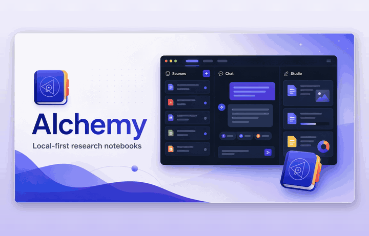
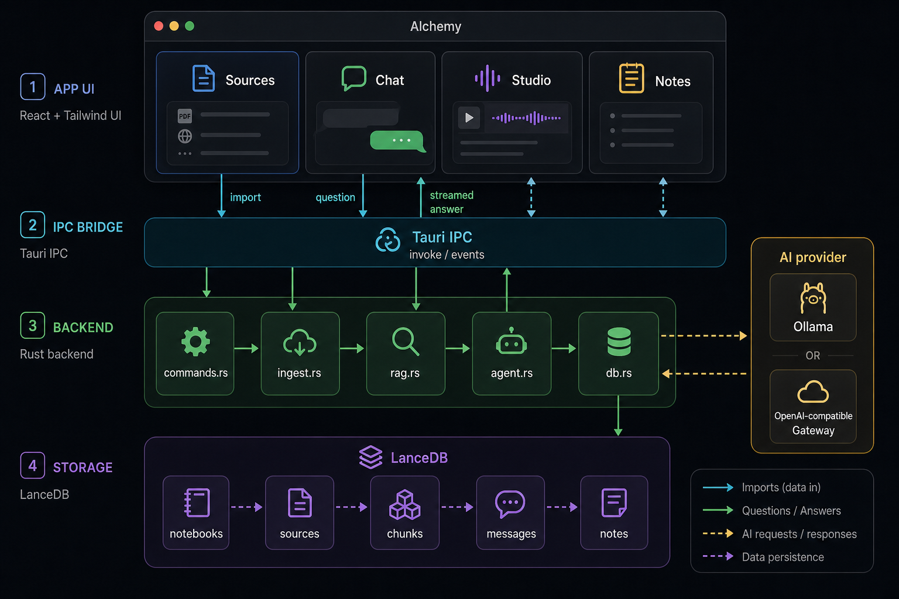
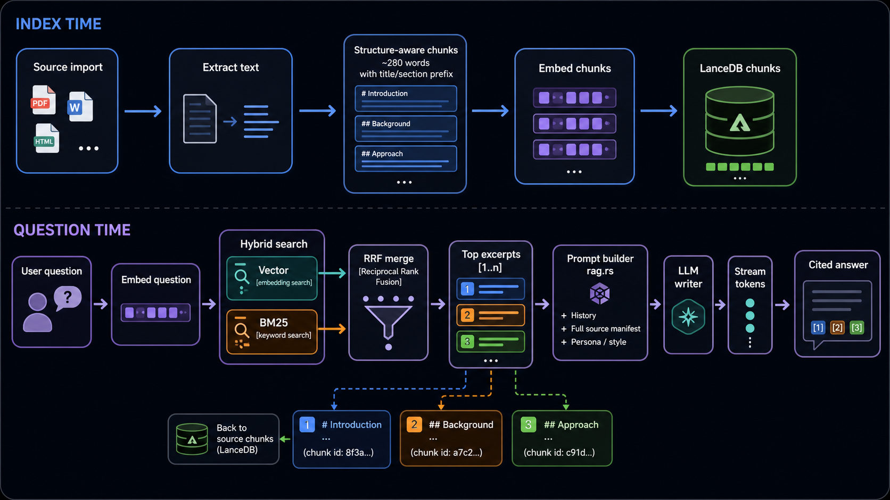
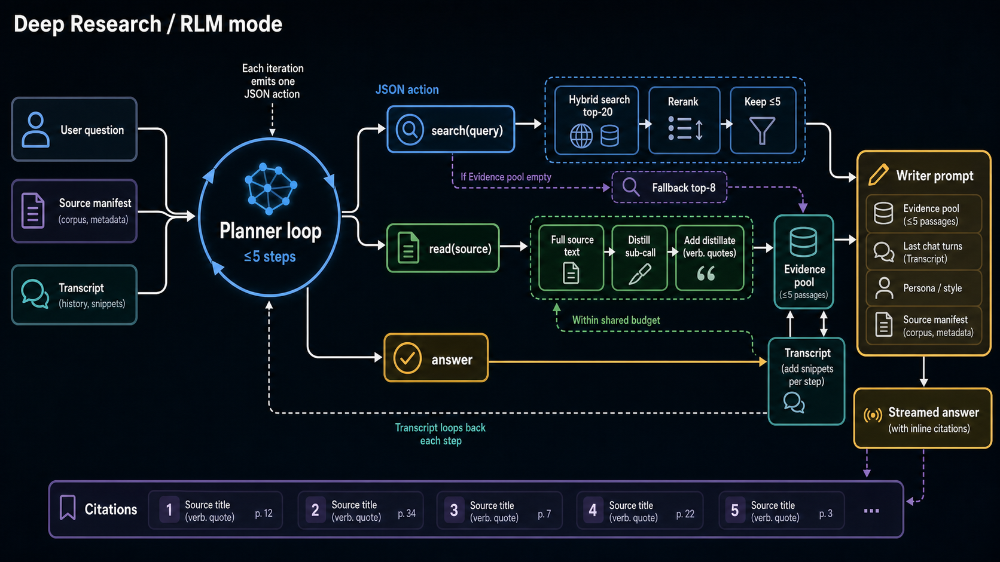
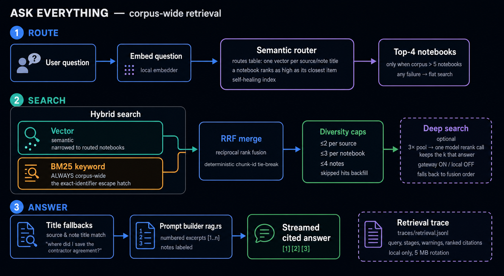
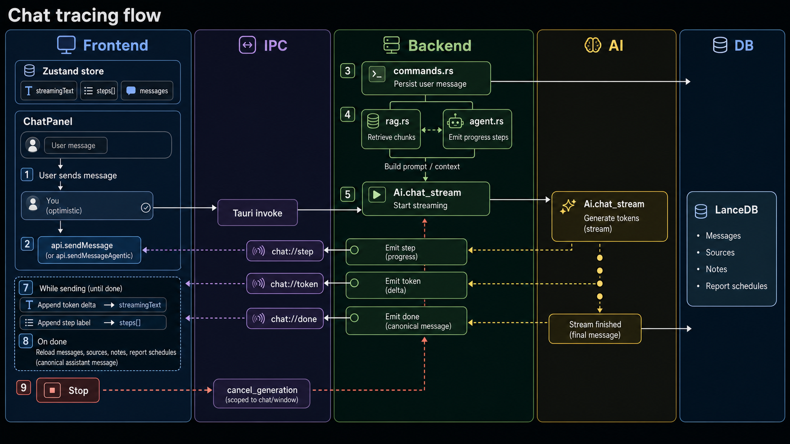

# Alchemy

A local-first, privacy-respecting desktop app inspired by
[NotebookLM](https://notebooklm.google/). Import your sources, chat with them
grounded in citations, and generate documents — running **100% on your
machine** when you want it to. No accounts, no cloud requirement, nothing
leaves your laptop by default.

Chat with any model you already have (see
[docs/RFC-inference-providers.md](docs/RFC-inference-providers.md)):

- **On this Mac** — Apple's on-device model on macOS 26 with Apple
  Intelligence: fully offline, no setup, retrieval auto-tuned to its window.
- **Local servers** — [Ollama](https://ollama.com), LM Studio, vLLM, or any
  OpenAI-compatible localhost endpoint.
- **Subscriptions you already pay for** — Claude Code, Codex, Gemini CLI,
  Cursor, OpenCode, GitHub Copilot, Hermes, and IBM Bob run headless through
  their own CLIs; your existing sign-ins carry the bill and answers are
  captioned with the model (and metered cost when reported).
- **API gateways** — 30+ presets (OpenAI, Anthropic, NVIDIA, OpenRouter,
  Groq, …) or any custom OpenAI-compatible URL. See
  [Using a cloud LLM](#using-a-cloud-llm-any-openai-compatible-gateway).

Whatever answers, your sources stay on-device: embeddings default to the
built-in private embedder, podcast audio is voiced locally by Kokoro, and
image OCR runs through your own Ollama vision model.

> Built with **Tauri 2 + React** front-end, a **Rust** backend, **LanceDB** for
> embedded vector + relational storage, and a **Linear-inspired** UI with 20 themes.

[](https://github.com/thrashr888/alchemy/actions/workflows/ci.yml)

[](demo/alchemy-demo.mp4)

*One minute of Alchemy — [full demo with sound](demo/alchemy-demo.mp4): an agent fills a
notebook live over MCP, chat cites exact passages, and the notebook becomes a
two-host podcast voiced on-device.*

<details>
<summary>Click a citation to open the source, scrolled to the exact passage</summary>


</details>

---

## Features

- **Notebooks** — a home screen of notebooks (most-recent first); opens to your last one.
- **Sources** — import **PDF**, **Office** (`.docx` / `.pptx` / `.xlsx`), **CSV/TSV**,
  **images**, **text**, **Markdown**, paste text, or fetch a **URL** — including
  link-shared **Google Docs, Sheets, and Slides** (paste the link, or drag the
  `.gdoc` / `.gsheet` / `.gslides` files from a local Google Drive folder). Each is
  extracted, chunked, and embedded locally. Drag-and-drop onto the Sources panel.
  File sources remember their on-disk path — **Refresh** re-reads a changed file
  (and URL sources re-fetch); **Show in Finder** jumps to the original.
  Failed/blocked imports show an error badge and can be retried; edited/refreshed
  sources are re-embedded.
- **Folder sources** — add a whole folder (OneDrive/Dropbox/Drive/iCloud included):
  it scans supported files, keeps syncing on a timer, and lists cloud
  placeholders without downloading them.
- **Mac apps as sources** — connect **Apple Notes** (individual notes),
  **Reminders** lists, rolling **Calendar** windows, and **Stocks** watchlists
  via [cider](https://github.com/thrashr888/cider); they re-sync automatically.
  Notes can be edited (and reminders added) from inside Alchemy — writes go to
  the real app and sync back.
- **Command menu** — press **⌘K** anywhere to search notebooks, add sources, generate
  documents, toggle panels, and switch themes.
- **Ask everything** — the ⌘K palette (and the homepage ask box) answers questions
  across **all** notebooks at once: semantic routing to the likely notebooks,
  hybrid retrieval with diversity caps, optional deep rerank on gateway
  models, a streamed answer with notebook chips, and citations that jump
  straight to the passage ("which notebook has the SNDK stock data?"). Broad
  questions — "summarize the themes," "what do these disagree on?" — are
  answered across every relevant source, not just the closest passages.
  ⌥Space summons it from anywhere.
- **Part of the Mac** — `alchemy://` deep links, a menu bar extra (ask, add the
  clipboard as a source, recent notebooks), "Add to Alchemy" in every app's
  Services menu, and Spotlight-indexed notebooks and notes.
- **Web clipper** — the [Alchemy Web Clipper](https://chromewebstore.google.com/detail/alchemy-web-clipper/bdiidbpifneigmcknjbgolbclbbgjheh)
  Chrome extension adds the current page, a link, or a text selection to a
  notebook from the toolbar or right-click menu — it just composes an
  `alchemy://add` deep link, so it needs no host permissions, stores nothing,
  and makes no network requests. The same folder loads in Firefox and Safari
  (see [extension/chrome/](extension/chrome/README.md)).
- **OCR** — image sources and scanned/image-only PDFs are transcribed by a local
  vision model (dedicated OCR models like `glm-ocr` / `deepseek-ocr` recommended).
- **Grounded chat** — streamed answers that cite the exact source passages they drew
  from, with a **"Deep research"** agentic mode that plans multiple retrieval steps.
  Copy a response or save it as a note.
- **Retrieval at scale** — search quality holds as a notebook grows past millions of
  characters. The retrieval budget adapts to corpus size, and a scale fence keeps
  recall flat from 1M to 10M chars (verified) — a large source list stays fully
  searchable instead of diluting every answer.
- **Source gists** — every source gets a short distilled overview in the background,
  so corpus-wide questions ("what's in here?", "which source covers X?") find the
  right document even when no single passage is an obvious match. Captured web pages
  also get a per-chunk context pass and shed navigation cruft, so search over clipped
  articles reads much closer to search over clean documents.
- **Reader** — sources and notes open in a center-column reader (Chat ⇄ Reader
  tabs in the toolbar), never a modal: click through the rails to swap
  documents, with browser-style **back/forward** (⌘[ / ⌘]), **j/k** to step
  through the notebook, **⌘F find-in-source**, and per-document word/char/token
  counts. Markdown sources render as real markdown (GitHub-flavored, including
  `<details>` and friends), **relative links resolve** — a link to another
  source in the notebook jumps straight to it, wiki-style — and your chat
  reading preferences (font, size, alignment) apply to documents too. Code
  files render with syntax highlighting, with find-in-source over the
  colored view.
- **Select-to-ask** — highlight any passage in the source reader to **Explain** it,
  **Compare** it against your other sources, or stage it in the chat composer with
  your own question.
- **Audio Overview** — one click turns a notebook into a two-host podcast episode,
  scripted by your chat model and voiced **entirely on-device** by
  [Kokoro-82M](https://huggingface.co/hexgrad/Kokoro-82M) neural TTS (a one-time
  ~93 MB download). The script stays readable and editable as a note; the
  episode plays inline.
- **Studio generators** — one-click **Summary**, **FAQ**, **Study guide**, **Briefing**,
  **Timeline**, **Insights** (cross-source connections, contradictions & surprises),
  **Data table**, **Problems** (finds errors/gaps/contradictions), **Flashcards**,
  **Quiz**, **Slide deck**, and a **Mind map**, plus HashiCorp-style
  **PRD**, **PR/FAQ**, **RFC**, and a **Skill** (SKILL.md) generator. Add custom
  instructions, and **rebuild** any document against the latest sources.
- **Artifacts are real, not text dumps** — **flashcards** are a flippable deck
  with **Leitner spaced repetition** (grade yourself; cards return on a
  1/3/7/21-day schedule, persisted per deck); **quizzes** grade each answer
  with the key's explanation and a running score; **slide decks** are
  Marp-style markdown rendered as true 16:9 slides — layouts inferred per
  slide, color themes drawn from the app's own theme catalog plus a font
  axis (both switchable, persisted in front-matter), a fullscreen **Present**
  mode, and **one-click PDF export** (landscape 16:9 pages; flashcards export
  a study sheet) — all local via the native print system; **mind maps** are a
  native SVG on a **pannable canvas** (drag or scroll, Photoshop-style).
- **Notes** — a **WYSIWYG** editor (Markdown under the hood), copy to clipboard,
  **Convert to source** to fold a note into the retrievable source set, and
  **Open in window** for a full-size reader (mind maps especially).
- **Share & import notebooks (OKF)** — export a whole notebook (sources + notes) as an
  [Open Knowledge Format](https://github.com/GoogleCloudPlatform/knowledge-catalog/blob/main/okf/SPEC.md)
  bundle: plain markdown concepts with YAML frontmatter, indexes, and a log —
  readable by humans and agents alike. **Share as a single `.okf.zip`** to send a
  notebook to a coworker or another machine, and **import** a zip or bundle folder
  (drag it onto the window, or Import… on the home screen) into a new notebook or
  merged into an existing one — sources re-embed locally, duplicates skip.
- **Agent access (MCP)** — an embedded MCP server (localhost-only) lets agents
  create notebooks, add sources, run hybrid search (per-notebook or across the
  whole corpus), write notes, and act on connected Mac items (update an Apple
  Note, add a reminder) — and connect Mac items themselves by passing a
  `cider://` origin (a Reminders list, Notes note, Calendar window, or Stocks
  watchlist) to `add_source` — with changes appearing live in the app. One-click connect (config + companion skill) for
  **Claude Code, OpenAI Codex, GitHub Copilot, VS Code, OpenCode, Gemini CLI,
  Google Antigravity, Factory Droid, AWS Kiro, IBM Bob, and Hermes** in
  Settings → Agents (see `docs/RFC-mcp-server.md`).
- **Periodic reports** — schedule a notebook to refresh its URL sources and generate a
  timestamped report note on an interval; each run sees the previous report and
  calls out what changed since.
- **Model tooling** — live chat/embed **health check**, per-model **tokens/sec**
  tracking, MLX-accelerated model suggestions, and safe **re-embed-on-model-switch**.
- **20 themes** — Midnight, Light, Slate, Dracula, Monokai, One Dark, Nord,
  Gruvbox, GitHub, GitHub Light, Solarized, Solarized Light, Tokyo Night,
  Matrix, Synthwave '84, Claude, OpenAI, Catppuccin Latte, Rosé Pine Dawn,
  Sepia.
- **Themed design elements** — themes with strong iconography restyle the
  dithered backdrop to match (Matrix code rain, Synthwave '84 a striped sun
  over a perspective grid, Sepia static paper grain), open the hero on their
  own transmutation sigil, and bring their own thinking verbs; a daily
  epigraph is generated by your local model (curated fallbacks when
  inference is off). Each notebook's color carries through the workspace —
  title dot, capacity gauge, and the chat sigil.

## Architecture



```
┌──────────────────────────────── Tauri window ────────────────────────────────┐
│  React + Tailwind                                                            │
│  Home (notebook picker)  |  Sources │ Chat (streaming) │ Studio (docs+notes) │
└───────────────────────────────── IPC (invoke / events) ──────────────────────┘
                                     │
┌───────────────────────────────── Rust backend ───────────────────────────────┐
│  commands.rs   Tauri command surface + per-model stats                       │
│  ingest.rs     extract (pdf/office/url/text) → normalize → structure-aware   │
│                chunking (paragraphs/headings, title+section context prefix)  │
│  pdf.rs        PDFium page rasterization for scanned-PDF OCR                 │
│  ai/ollama.rs  embeddings, streaming chat, OCR over Ollama HTTP              │
│  agent.rs      agentic "deep research" retrieval loop                        │
│  rag.rs        retrieval prompt assembly + generator prompts                 │
│  router.rs     semantic router: routes questions to likely notebooks         │
│  trace.rs      local retrieval trace JSONL (stages, warnings, citations)     │
│  db.rs         LanceDB tables: notebooks, sources, chunks(+vectors+FTS),     │
│                messages, notes, report_schedules, routes; hybrid search      │
│                (RRF + tie-break), diversity caps, search traces              │
└──────────────────────────────────────────────────────────────────────────────┘
                                     │
                              Ollama (localhost:11434)
```

The RAG loop: a question is embedded and the `chunks` table is searched two
ways — vector similarity (finds paraphrases) and BM25 full-text (finds exact
names, codes, and numbers that embeddings miss) — with the two result lists
merged by reciprocal rank fusion (deterministic: score ties break by chunk id,
so the same question always cites the same passages). Every retrieval also
appends a local trace line (stages, warnings, citations) to
`traces/retrieval.jsonl`, and agents can call the MCP `search_debug` tool to
see exactly why a passage did or didn't surface. Chunks are structure-aware:
whole paragraphs
packed to ~280 words, headings kept with their sections, and each chunk is
embedded with a `[Doc title › Section]` context prefix (the stored text stays
verbatim so citation highlighting still works). The top passages become
numbered excerpts in the prompt, and the model answers with `[n]` citations
that map back to the retrieved chunks shown in the UI.
See [docs/ARCHITECTURE.md](docs/ARCHITECTURE.md).



### Deep-research (agent mode) loop

In agent mode (`agent.rs`), the model plans its own retrieval before answering.
Each step it emits one JSON action; evidence accumulates until it decides it
has enough:



```
User question
      │
      ▼
┌─ Planner loop (≤5 steps, one JSON action per step) ──────────────────────────┐
│                                                                              │
│  "search <query>"  hybrid search (vector + BM25, RRF) → top-20 pool          │
│                        │                                                     │
│                        ▼  rerank (one model call)                            │
│                    the ≤5 passages that actually answer ─► evidence pool     │
│                    180-char snippets ─────────────────────► transcript       │
│                                                                              │
│  "read <source>"   fetch full text (shared budget:                           │
│                    120k chars gateway / 12k local)                           │
│                        │                                                     │
│                        ▼  sub-read (one model call)                          │
│                    distill against the question into                         │
│                    verbatim quotes (≤4k chars) ───────► evidence pool        │
│                    same distillate ───────────────────► transcript           │
│                                                                              │
│  "answer"          enough evidence — exit loop                               │
│                                                                              │
│  The transcript (searches + distilled reads so far) is re-sent to the        │
│  planner each step so it can decide what's still missing.                    │
└──────────────────────────────────────────────────────────────────────────────┘
      │  fallback: nothing gathered → direct top-8 vector search
      ▼
┌─ Writer (one streamed call) ─────────────────────────────────────────────────┐
│  grounding rules + persona  │  last 6 chat turns  │  full source manifest    │
│  numbered excerpts [1..n] from the evidence pool                             │
│                └─► streamed answer citing [n], mapped back to sources        │
└──────────────────────────────────────────────────────────────────────────────┘
      │
      ▼
Persisted message — citation snippets are the distilled verbatim quotes, so
the excerpts shown in the UI are exactly what the writer saw, and clicking a
citation highlights real passages in the source.
```

Because a read returns distilled evidence rather than raw text, the writer's
context stays small no matter how many or how large the read documents are —
the read budget bounds each sub-read call, not the final prompt.

Studio generators and scheduled reports share the retrieval improvements too:
they build their corpus by budgeting fairly across all sources (waterfill),
and any source that exceeds its allocation gets the same distillation
treatment — the overflow is distilled against the generation instructions and
appended, so a big source contributes its relevant passages instead of losing
everything past the cut.

### Corpus-wide retrieval (Ask Everything)

Meta-chat answers questions across every notebook at once, through a staged
pipeline where each stage earned its place in the eval harness
(`cargo test --lib retrieval_eval -- --nocapture`, ranked metrics in
`docs/RFC-retrieval-maturity.md`):



- **Semantic routing** — one embedded route per source/note title (a notebook
  ranks as high as its closest item); questions search the top-4 notebooks
  when the corpus is big enough to benefit. The index self-heals: an
  unchanged corpus re-embeds nothing.
- **Hybrid with an escape hatch** — routing narrows only the vector side;
  BM25 stays corpus-wide, so an exact invoice number or error code the
  router couldn't see still surfaces. Measured: routed recall equals flat
  recall with the escape hatch, and drops without it.
- **Diversity caps** — at most 2 chunks per source, 3 per notebook, 4 notes,
  with skipped candidates backfilling in score order: one chatty notebook
  can't crowd out the rest, and shaped search never returns fewer hits than
  flat.
- **Deep search** — optionally retrieve a 3× pool and let the chat model keep
  the passages that actually answer (default on for gateway models, off for
  local; any failure falls back to fusion order).
- **Title fallbacks** — "where did I save the contractor agreement?" matches
  source and note titles directly even when no chunk cracks the top-k.
- **Source gists** — each source is distilled to a short overview in the
  background and indexed alongside its chunks; those overview rows join
  fusion as their own capped class (default 2), so "what's in here?" /
  "which source covers X?" questions match the right document even when no
  single passage is a strong hit. A gist hit cites its source and drills down
  into it; the gates (identifier-overlap, length, degeneracy) keep a bad gist
  from misrouting.
- **Corpus-adaptive k** — the retrieval budget grows with corpus size (log
  curve, +1 per doubling past ~200k chars, capped per model profile), so a
  10M-char corpus isn't starved by the k that suits a 50k one. RRF ties break
  by score, then source recency, then chunk id — determinism preserved.
- **Global answers (map-reduce)** — broad questions (enumerative/comparative
  markers, no identifier-shaped token) take a lazy map-reduce path: retrieve
  gists corpus-wide, run one scoped extract per covered source (bounded
  fan-out), then synthesize a single answer cited at source granularity with
  chunk drill-down on demand. Any failure at any step degrades to the pointed
  path, byte-for-byte.

A deterministic scale fence (`eval_scale_fence`) makes the corpus-scale claim
falsifiable: across synthetic 1M / 3M / 10M-char corpora, exact and paraphrase
recall both hold at 1.00 while adaptive k grows 10 → 13 — recall flat from 1M
to 10M, a passing eval rather than extrapolation.

### Chat tracing flow

The UI traces long-running chat work through Tauri events. `ChatPanel` starts a
send through the Zustand store and `api.sendMessage` / `api.sendMessageAgentic`;
the backend persists the user turn, emits `chat://step` progress labels for
tooling and agent work, emits `chat://token` deltas as the model streams, then
emits `chat://done` after the assistant message is saved. The store appends
live text into `streamingText`, records progress labels in `steps[]`, and then
reloads canonical messages, sources, notes, and report schedules.



## Install (Apple Silicon)

With [Homebrew](https://brew.sh):

```sh
brew tap thrashr888/tap
brew install --cask thrashr888/tap/alchemy
```

Or download the latest `Alchemy_x.y.z_aarch64.dmg` from
[Releases](https://github.com/thrashr888/alchemy/releases), open it, and drag
**Alchemy** to Applications. Builds are **signed with a Developer ID and
notarized by Apple**, so they open with a normal double-click.

Requires [Ollama](https://ollama.com) running locally.

## Prerequisites (development)

- **[Ollama](https://ollama.com)** running locally (`ollama serve`).
- Models pulled — for example:

  ```bash
  ollama pull nomic-embed-text        # embeddings
  ollama pull gpt-oss:120b            # chat (or any chat model)
  ollama pull glm-ocr                 # OCR (optional, for images / scanned PDFs)
  ```

- **Rust** (stable) and **Node** with **pnpm**. `protoc` is required to build
  LanceDB (`brew install protobuf`).
- The PDFium library (for scanned-PDF OCR) is **fetched automatically on first
  build** by [`scripts/fetch-pdfium.sh`](scripts/fetch-pdfium.sh) (via `build.rs`);
  no manual step needed.

## Develop

```bash
pnpm install
pnpm tauri dev
```

The first build compiles LanceDB and is slow; subsequent builds are fast.

## Test & lint

```bash
cd src-tauri
cargo test          # unit tests (+ a graceful-skip Ollama integration test)
cargo fmt -- --check
cargo clippy --all-targets -- -D warnings
```

CI ([.github/workflows/ci.yml](.github/workflows/ci.yml)) runs the frontend
typecheck/build plus the above on every push and PR.

## Configuration

Open **Settings** (gear icon) to set the Ollama URL and choose models. Defaults:

| Setting          | Default                    |
| ---------------- | -------------------------- |
| Ollama URL       | `http://localhost:11434`   |
| Chat model       | `gpt-oss:120b`             |
| Embedding model  | `nomic-embed-text:latest`  |
| Vision model     | _(unset — OCR disabled)_   |

Switching the embedding model prompts to **re-embed all sources** (models produce
incompatible vectors), so retrieval never silently breaks. Data is stored in the OS
app-data directory under `lancedb/`.

## Using a cloud LLM (any OpenAI-compatible gateway)

Ollama stays the default, but Alchemy can route **chat, generation, deep research,
and OCR** through any OpenAI-compatible gateway instead — useful on machines that
can't run local models (e.g. a 16 GB laptop). The same path works for LM Studio,
vLLM, LiteLLM, OpenRouter, enterprise gateways, or Ollama's own `/v1` endpoint.

With a gateway selected, **sources still stay local**: embeddings run on the
**built-in CPU embedder** (a ~30 MB model downloaded on first use, no Ollama
required), so nothing but your chat turns leaves the machine.

### Configuring it in Alchemy

During **onboarding** (or later in **Settings → Models**):

1. Switch the provider to **OpenAI-compatible gateway**.
2. Enter the gateway's base URL (usually ends in `/v1`) and paste your API key.
3. Click **Save & check** — Alchemy lists the gateway's models, auto-selects one,
   and shows **Connected**. Pick a different model from the dropdown any time.

Keys are stored only in the local `ai_config.json` and sent solely as an auth header
to the gateway you configure — never anywhere else. LiteLLM-style gateways with
non-standard key schemes are handled automatically. Alchemy does no in-app
accounting — usage is whatever your gateway bills.

### Provider quick-reference

Any OpenAI-compatible endpoint works. Settings that are known-good:

| Provider       | Gateway URL                                      | API key                                                                     | Notes                                                        |
| -------------- | ------------------------------------------------ | --------------------------------------------------------------------------- | ------------------------------------------------------------ |
| **OpenAI**     | `https://api.openai.com/v1`                      | `sk-…` from [platform.openai.com](https://platform.openai.com/api-keys)     | `gpt-4o` & friends are vision-capable (works for OCR too)    |
| **Anthropic**  | `https://api.anthropic.com/v1`                   | `sk-ant-…` from the [console](https://console.anthropic.com/settings/keys)  | Via Anthropic's OpenAI SDK-compat layer; `sk-ant-` keys get the right headers automatically |
| **OpenRouter** | `https://openrouter.ai/api/v1`                   | `sk-or-…` from [openrouter.ai/keys](https://openrouter.ai/keys)             | One key, hundreds of models (`anthropic/…`, `google/…`, …)   |
| **Groq**       | `https://api.groq.com/openai/v1`                 | from [console.groq.com](https://console.groq.com/keys)                      | Very fast open-weight models                                 |
| **IBM Bob**    | `https://api.us-east.bob.ibm.com/inference/v1`   | `bob_…` from the Bob portal (IBM-internal)                                  | Bob's `Apikey` scheme & team headers are handled automatically |
| **LM Studio**  | `http://localhost:1234/v1`                       | _(none)_                                                                     | Local server; load a model in LM Studio first                |
| **Ollama**     | `http://localhost:11434/v1`                      | _(none)_                                                                     | Ollama's own OpenAI-compat endpoint (or just use the native Ollama provider) |

You can leave the **Gateway URL empty** for OpenAI, Anthropic, OpenRouter, Groq,
and Bob-style keys — Alchemy infers the URL from the key format.

For OCR of images and scanned PDFs, set a **vision-capable** model as the gateway
vision model (e.g. `gpt-4o`, a Claude model, or any vision model on OpenRouter);
leaving it empty disables OCR. Embeddings never leave your machine regardless of
provider — the built-in on-device embedder (`potion-base-8M`) indexes your sources.

## Releases

Releases are cut **locally** on Apple Silicon — one command builds, signs,
notarizes, and publishes:

```bash
scripts/release.sh 0.4.2
```

See **[RELEASE.md](RELEASE.md)** for what it does, one-time setup (Developer ID
cert + notary profile), and the manual CI fallback
([`.github/workflows/release.yml`](.github/workflows/release.yml), triggered from
the Actions tab). Builds are signed with a Developer ID and notarized, so the
`.dmg` opens with a normal double-click.

The app bundles the [PDFium](https://github.com/bblanchon/pdfium-binaries) library
(for scanned-PDF OCR). An Intel (x86_64) build is possible on a `macos-13` runner
but those runners queue for hours; it can be re-added to the matrix if needed.

## Scope

Video overviews are intentionally out of scope. Notes are not embedded into
retrieval on their own — **Convert to source** to make a note retrievable.
