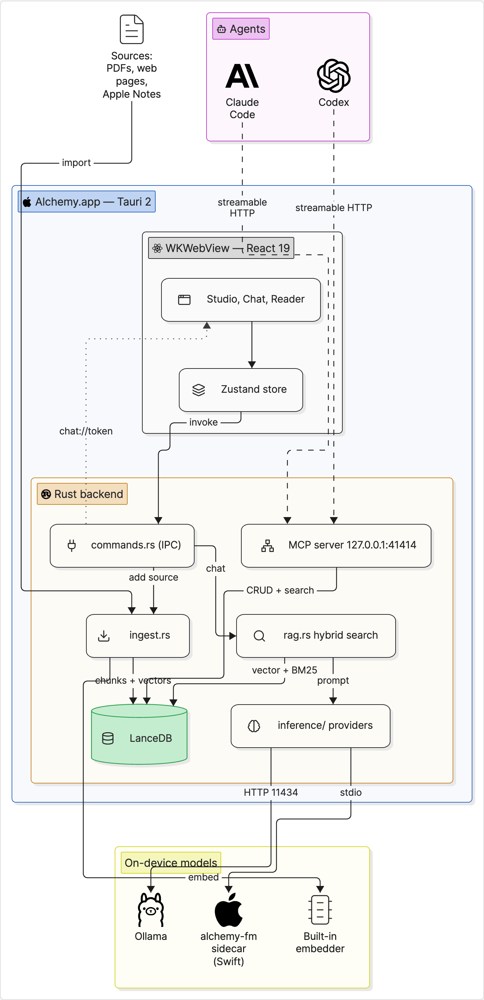
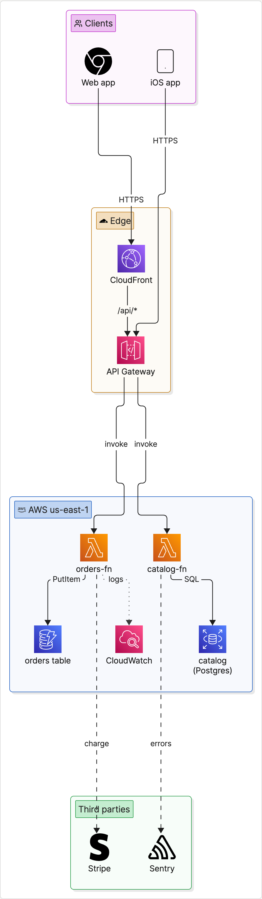
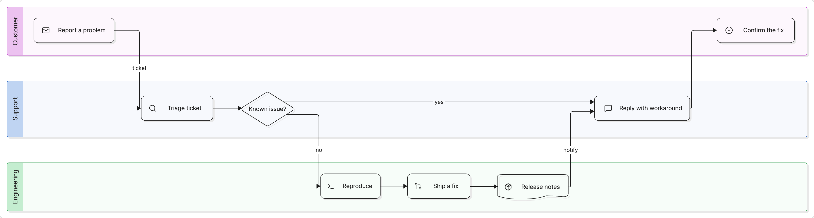
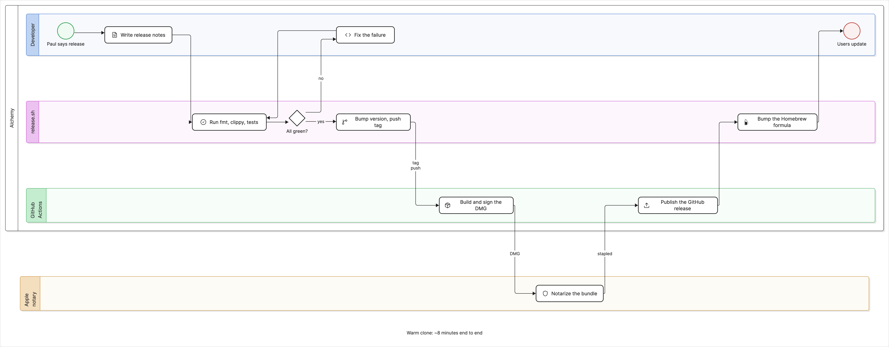
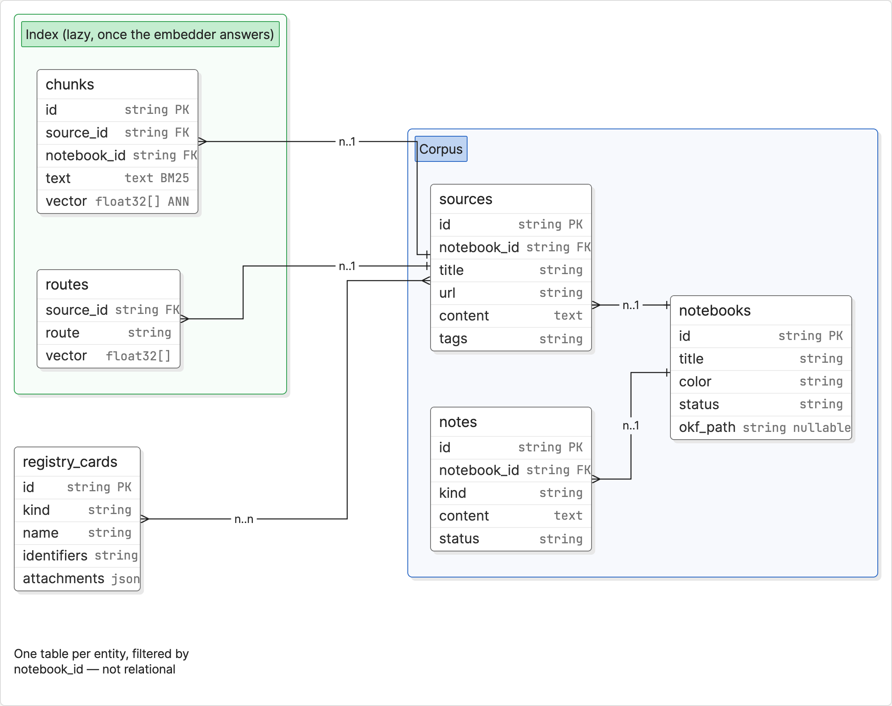
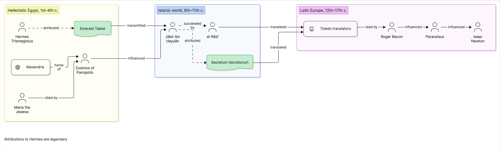
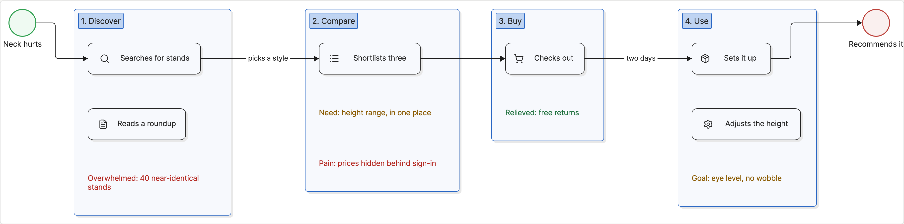

# RFC: Diagrams with eraser-diagrams

Studio drew one kind of diagram before this: `uml`, Mermaid source the
model writes and the WebView renders. Mermaid is right for class, sequence,
state, and ER diagrams and wrong for the diagram people actually want from
a corpus about a system — boxes with the technology's icon on them, grouped
by tier or host, with labeled lines. This RFC evaluates
[eraser-diagrams](https://github.com/eraserlabs/eraser-diagrams) (MIT) for
that job, ships an `architecture` artifact on it, and then four more kinds
on the same pipeline: `process` (swimlanes), `data_model` (tables and
cardinalities), `relationship` (who relates to whom), and `journey`
(stages, touchpoints, pain points). Mind maps stay native.

**Verdict:** yes, in the WebView, with one piece of our own. eraser's
resolve and render packages run in WKWebView with no Chromium and no
network; the template library is data. What eraser does not do is place
anything — entity coordinates are input — so the generator writes topology
and a small deterministic layout of ours (`src/lib/diagramLayout.ts`) puts
it on the page.

## Findings

**Rendering without Chromium.** The monorepo's published packages split
cleanly: `@eraserlabs/protocol` (types), `@eraserlabs/resolve` (validate,
sanitize, inline icons — pure, "runs in the browser playground"),
`@eraserlabs/layout` (line routing), `@eraserlabs/render` (an in-page
fill → mount → measure → route → apply engine exposed as
`window.__eraser`), and `@eraserlabs/diagrams`, the "impure conductor" that
owns playwright-core and the stock library. The library is importable
from `@eraserlabs/diagrams/library` as data — 72 KB of template HTML/CSS
and JSON schemas — without touching Chromium; only the package root pulls
playwright. The three stock fonts (Shantell Sans, Inter, JetBrains Mono,
OFL) are 492 KB of woff2, vendored. So a document renders from JSON alone
inside the app. Two adaptations were needed: `@eraserlabs/layout` reads
`process.env` unguarded (a Vite `define` stubs it), and the render engine's
base stylesheet is global (`*{box-sizing}` and a rule on every
`svg[stroke='currentColor']` that would restyle every lucide icon), so it
runs in a same-origin iframe (`diagram-frame.html`, a second Vite entry —
the CSP's `script-src 'self'` rules out srcdoc) and the serialized scene is
copied into a shadow root in the viewer.

**Icons.** Names resolve against Eraser's hosted catalog: 3,865 SVGs,
4.8 MB, on a public GCS bucket with no CORS headers — so the WebView could
not fetch them even if we wanted the network call. The prototype vendors a
curated 178-icon set (179 KB raw, `src/assets/diagrams/icons`) covering
clouds, stores, runtimes, agents, and the generic glyphs an architecture
needs; the prompt carries the same list and a test holds the two in
lockstep. Unknown names draw eraser's placeholder glyph plus a warning the
viewer shows. A Rust fetch-and-cache path for the long tail (icon name in,
SVG out, `~/Library/Application Support` cache) is the obvious follow-up
if the curated set proves too small.

**The document schema.** MDP 0.1: `{ entities, connections }` of tagged
objects. Stock entity tags are `Shape` (12 shapes, text runs, optional
icon), `Icon` (icon + caption), `Group`/`Lane`/`Pool` (containers, joined
via `containerId`), `Textbox`, BPMN `Activity`/`Event`/`Gateway`,
`DatabaseTable`, `Legend`, `Divider`; connections default to `Relationship`
(`from`, `to`, `label`, arrowheads, ports, line style). Colors are eight
palette tokens or any CSS color. The compact contract in the prompt
(`rag.rs`, `architecture_instruction`) is four entity forms, the connection
form, the palette, and the icon list — about 1.6 KB plus icons.

**Placement.** eraser's README is explicit: "treats entity placement as
input." Its own examples hand-author `x`/`y`. A model guessing pixels is
the failure mode Mermaid spares us, so the `architecture` document carries
no coordinates (any the model volunteers are dropped) and
`diagramLayout.ts` places it: containers laid out recursively and sized
around their members, siblings ranked by longest path over the lifted
connections (cycles cut in DFS order), ranks stacked as bands along a
`direction`, swimlanes (`Lane`/`Pool`) running their steps across the flow
with columns shared between sibling lanes. The engine renders twice —
once on estimated sizes to learn what each component measures, once on the
measurements — in tens of milliseconds. Placement is pure and unit tested.

**What it does that Mermaid does not.** Technology icons on components
(the reason to want it); nested groups with titles, tints, and icons;
swimlane processes with real lanes; routed orthogonal lines with placed
labels, dashes, and arrowheads; a hand-drawn (`rough`) typeface option.
What Mermaid does that it does not: sequence, class, state, and ER
diagrams, Gantt, git graphs. Those stay `uml`.

 

**Export.** The serialized scene is ordinary positioned HTML, so the
existing print pipeline (docs/RFC-note-export.md) covers PDF and PNG:
`PrintArchitecture` scales the scene to the sheet width on a white ground
and signals when it has settled, `export.rs` rasterizes it at diagram
width like `uml`. No canvas, no foreignObject, no Chromium.

## The kind

- `architecture` joins `ARTIFACT_KINDS` (`rag.rs`), so Studio, the chat
  router, report schedules, and the MCP `generate` tool all take it with
  no further wiring; label "Architecture diagram", learning family, beside
  UML in the picker.
- The prompt asks for the JSON object only: 6–16 entities in 1–5 groups,
  components named as the sources name them, no invented parts, every
  connection labeled in four words or fewer, icons from the list or none.
- `ArchitectureDiagram.tsx`: title chip, warning count, Source toggle,
  pan/zoom canvas (`PanCanvas`); a document that will not resolve shows
  the JSON with the resolver's message, which names the element and
  suggests the fix (did-you-mean on tags, icons, enums).
- The note stores the document verbatim, so it is also a valid input to
  the upstream CLI — portable, per the sovereignty invariant.
- Harness: `scripts/diagram-harness/` renders the hand-written samples —
  three architecture documents and one per other kind, each naming its
  `kind` — through the real pipeline (`pnpm exec vite --config
  scripts/diagram-harness/vite.config.ts`, then
  `node scripts/diagram-harness/snap.mjs` to refresh `docs/images/`).

## The other four kinds

One document contract, five vocabularies. `src/lib/diagramDoc.ts` owns the
kinds: each admits the stock tags its prompt teaches (`KIND_TAGS`) and the
parser rejects an entity or connection tagged outside that set, naming the
entity and the kind's own tags — a data model cannot quietly become an
architecture diagram, and the error is a fix, not a shrug. `rag.rs` carries
the same lists as `DIAGRAM_TAGS`; a vitest holds the two in lockstep and a
Rust test checks every prompt actually names its tags. The viewer is one
component (`DiagramView`, keyed by kind), the print sheet one
(`PrintDiagram`), and the note-viewer switches route every kind in
`DIAGRAM_KINDS` to them. Studio: Process map and Journey map sit in the
documents family; Data model and Relationship map beside Architecture in
learning. MCP's `generate`, the chat router, and report schedules take the
kinds through `ARTIFACT_KINDS` with no further wiring.

Each kind asks something different of the layout (`layoutHints` in
`eraserDiagram.ts`, flags on `LayoutNode`):

**Process map** — `Pool`/`Lane` with BPMN `Activity`, `Event`, `Gateway`,
scene direction `down`. A lane holding steps runs them across the flow and
is a `lane`: every lane in the scene, siblings or lanes in different pools,
ranks its steps together and shares one set of columns, so a step's column
is its place in the whole process (the "global step alignment across
nested lanes" the first cut left out). A pool holding lanes stacks them as
rows in document order — a level with lanes in it never ranks them side by
side because no edge happened to order them. The prompt asks for 2–5
lanes, 6–20 steps, one start event and at least one end, gateways with one
labeled edge per outcome. An `Event`'s caption is wider than its 56px disc
and centered under it; pass 2 shifts the body inside its box by the ink's
left overhang so the caption never runs over a lane's title band.

Lanes are the actors. The first live map drew one lane per step —
"issue", "OWNERS", "An OWNER", "release issue", "announcement email" —
a staircase with one Activity on each tread, because the prompt said how
to spell a Lane before it said what one is. It now opens with the
definition (a lane is who acts: a person, role, team, or system; a step
is what that actor does, a short verb phrase, in the lane of whoever does
it), a worked split of one sentence into two lanes and three steps, and
the tell: a lane holding a single step means the lanes are wrong. The
parser watches for the same tell — when more than half of a process map's
lanes hold at most one step it adds a warning ("lanes look like steps"),
a chip beside the title, not a rejection.

**Data model** — `DatabaseTable` (label, `fields` of `name`/`type`/`meta`,
exactly the stock schema) in optional `Group`s, direction `right`. The
prompt asks for the label form of a relationship — `"n..1"` on the
referencing side — and `prepareForRender` turns a label that reads as a
cardinality (`1..n`, `n..n`, `one-to-many`, `1:n`) into a
`DatabaseRelationship` with the matching `relType`, so eraser's crow's feet
draw from what the sources said. The stored note is untouched; the
derivation happens at render time. Tables size themselves; the estimate is
a row per field.

**Relationship map** — `Icon`/`Shape` for people, organizations, works,
places, in `Group`s per era, team, or domain; every edge directed and
labeled with the relation the sources state; `lineStyle: dashed` for a
contested one. For this kind only, `generate_content` appends a "Registry
cards for this notebook" block to the corpus — name, kind, one line, for
cards filed against the selected sources (`registry_context_block`) — so
the entities line up with cards the person can already inspect. It is
labeled as spellings, not facts.

**Journey map** — stages as columns, direction `right`: one `Group` per
stage with `sequence` set, so its members stack top to bottom in document
order (touchpoint `Shape`s first, then pain-point `Textbox`es), and the
level aligns column tops (`align: "start"`) rather than centering columns
of unequal height. Optional `Event`s at the root open and close the
journey. The stages are `Group`s rather than `Lane`s on purpose: eraser
draws a Lane's title as a vertical band with `writing-mode: sideways-lr`,
and six stage names read sideways are not a journey map.

## Rough edges from the first in-app run, and what changed

- **Opened at 100% and cropped.** `PanCanvas` takes the scene's size
  (`fit`) and opens with the whole thing in view — scaled down to the
  pane, never past 100% — and its reset control returns to that view.
  Mind maps and UML pass nothing and keep their old behavior.
- **A label on a line, a label on a group title.** eraser sets a
  connection's label at its path's midpoint; on a tight rank gap that
  midpoint lands on the next box or on a group's title chip. The layout
  now gives every rank boundary that a labeled edge crosses extra room
  (`labelRoom`), and counts the run a path makes through a container's
  padding and title on the way to a nested box, so the midpoint stays in
  the gap. Diagrams got taller for it; a label clear of a title is worth
  that. What is still eraser's: labels on long horizontal segments of a
  fan-out (three labels in a row under one box) and a label wrapped
  mid-word on a short segment.
- **The scene card narrower than its content.** Not reproducible in the
  harness (Chrome): every sample's ink sits inside its scene box, measured.
  See the in-app section for what the WebView does.
- **A first attempt that failed and retried without a word.** The retry
  was already there and already bounded: `AgentCli::chat_stream_steps`
  runs a CLI once more when the first attempt died inside 20 seconds with
  no output. It was silent because `crate::note!` is stderr-only — nothing
  reached the log or the note. Now the retry records a `warn` in the
  diagnostics log with the reason, and the queue runs generation through
  `chat_stream_steps`, so an engine's progress lines ("First attempt
  failed (…); retrying once…", "Loading … into memory…") become the
  running note's status detail in Studio. A job parked as `waiting` (engine
  down) and a job that fails both record to the log too, with the job,
  kind, notebook, and engine.
- **`path`/`fs`/`url`/`source-map-js` externalized warnings.** postcss,
  which `@eraserlabs/resolve` uses to parse the template library's CSS,
  names the four at module top level for the source-map and file paths it
  never takes here. `src/lib/nodeShims.ts` stands in for them (every export
  throws if reached) via a Vite alias; the harness renders every sample
  with a clean console.

## The in-app runs

Two runs through the real queue, real notebooks, real sources. The first
found the corpus path wrong for this family of artifacts; the second
measures the fix.

**First run** (Studio on `digitsflow/bonsai-8b` through Ollama, one slot).
`architecture` valid in 19.5 min; `data_model` valid in 34 min; `journey`
valid (Curated Supply); `relationship` valid but a tall narrow column —
`direction: "down"`, a group nested inside a group, a Textbox wired as an
edge endpoint (The History of Alchemy); `process` FAILED with "generation
exceeded 20 minutes" in Alchemy Development (50 sources, ~850k chars).

**Why.** `generate_content` built every artifact's corpus the same way:
waterfill the sources into the engine's corpus budget (24k chars on
device — ~480 chars per source across 50), and for every source over its
allocation, distill the overflow tail against the instruction
(`agent::distill`, uncached, one model call each) before the main prompt
is built. Right for a summary that should not drop a source's back half;
wrong for a diagram, which is a topology built from what each source *is
about*. On a 50-source notebook that is dozens of 8B calls ahead of the
diagram call, and the queue's 20-minute `RUN_DEADLINE` fires first. The
other kinds only survived because their notebooks were small.

**The gist decision.** The gist sweep (docs/RFC-infinite-context.md)
already writes one distilled overview per source. For every kind in
`DIAGRAM_KINDS`, the corpus is now `rag::diagram_corpus`: each source's
heading (title, URL or file line) and its stored gist — or the first
1,500 chars of its text when no gist exists yet — trimmed evenly to the
same budget the prose kinds get, and the `relationship` Registry block
after it. The builder is a pure function with no model handle, so it
cannot distill; a 50-source diagram is ONE model call. Sources without a
gist are counted and logged as one line. The waterfill-and-distill path
is the prose kinds' alone now (`waterfill_corpus`).

**Second run**, same notebooks, on this branch.

| kind | notebook | before | after |
| --- | --- | --- | --- |
| `process` | Alchemy Development (50 sources) | dozens of model calls, failed at 20 min | one model call: 14 s on the configured Studio provider (GitHub Copilot CLI); 5 min 50 s forced through Ollama (`muse-glimmer:30b-mlx`) via the MCP `generate` provider override |
| `relationship` | The History of Alchemy | valid, tall narrow column | one model call, 20 s: `direction: "right"`, 19 entities in two sibling groups, every edge labeled, no Textbox endpoint |

45 of the 50 sources had gists; the five without fell back to their head
(the log line says so). The process map parsed on the first attempt and
rendered: five lanes, one path from the opening event to the closing one
(`docs/images/in-app-process.png`). The relationship map's first document
did not render: the model wrote `"shape": "folder"` for a project, taking
the prompt's "a project is a rectangle with the folder icon" as a shape.
The prompt now enumerates the stock shapes again (the rewrite had lost
that line), and the parser coerces a `shape` outside eraser's list to a
rectangle — moving it to `icon` when it names one — with a warning the
viewer shows, so a one-token slip costs a chip, not the map
(`docs/images/in-app-relationship.png`).

What the relationship rewrite changed, beyond the corpus: the prompt asks
for `direction: "right"`, groups one level deep as siblings, people as
`Icon` `user`, works as `Shape` `document`, organizations and places as
`Shape`s with the `building`/`globe` icon, 8–20 entities, and a Textbox
that is never an endpoint; `parseDiagram` drops a relationship line into
a Textbox with a warning; and the layout aligns the kind's ranks flush
(`align: "start"`, as the journey map does) so a chain reads as a row
across its era instead of floating mid-column.

The second document exposed the other half of the tall column. A
relationship corpus is islands — eras the sources never connect to one
another — and the layered layout starts every island at rank 0, so with
`direction: "right"` six islands became one first column 1,400px tall
and three ranks wide. The layout now takes `islands: "along"`
(relationship only): each connected island is laid out on its own and the
islands follow one another along the flow, in document order, so the eras
read as a timeline. Architecture keeps the default — unrelated tiers
belong beside each other.

A chain of six eras is one strip: the same 28-entity map came out
3,871×423, a 9:1 sheet that fits the pane at 18%. Past a point a strip
wraps into rows. The rule is the sheet's shape, not the row's: the row
width that puts the whole sheet near 2.5:1 is √(2.5 × tallest island ×
strip length) — longer than the strip when the strip already fits, so a
short chain stays one row — capped at 2,400px, and never narrower than
the longest island, since an island cannot be split and a note dropped
alone under a 2,300px island is no improvement. The strip is cut into
that many rows in document order, each row taking islands until it holds
its share (`rowsFor`, `diagramLayout.ts`; unit tested). The literal
"row no wider than 2.5× the tallest island" would have put one ~600px
era per 1,057px row and rebuilt the column the chain exists to avoid.
The harness sample stays one row (its three eras are connected, one
island); the in-app map wraps into two.

**Pale captions.** In the app every Activity, Event, and Gateway caption
rendered in a light gray, much fainter than the harness. Not a palette
token — the live document colored no Activity — and not the lane tint.
eraser writes a caption's color as `var(--er-ink, #242424)` with
`--er-ink` inlined from the text run's own `color`; a run with none leaves
the property empty, `var()` substitutes nothing, and `color` falls back
to inherit, which in the harness is the page's black and in the app is
the dark theme's light-on-dark foreground reaching through the shadow
root. Lane titles set `#242424` outright, which is why only they stayed
dark. The scene root now sets the ink (`#eraser-scene{color:#242424}`,
appended to the scene's stylesheet in `eraserDiagram.ts`), so captions
are black on the white card wherever the scene lands — viewer, print
sheet, harness — and a run that names a color still gets it. Checked by
forcing the harness page's foreground to a pale gray and reading each
caption's computed color: `rgb(36, 36, 36)` throughout.

**Too many pieces.** Models overshoot the ranges the prompts ask for.
The parser knows each kind's cap (`KIND_CAP`: the top of each prompt's
Rules range, held in lockstep by a test that reads `rag.rs`) and counts
the kind's pieces — components, steps, tables, entities, touchpoints;
never the containers or notes that frame them. Past the cap by half again
it adds a warning naming the count ("31 entities; a relationship map
asks for 20 at most. Regenerate for a smaller one."). Nothing is
truncated: the document is the model's, and which twenty to keep is the
person's call.

## Risks

- **Bundle.** Three packages plus vendored assets: the lazy diagram chunk
  (resolve + library + render + icons) is loaded on first render only; the
  fonts are 492 KB of assets fetched on first use. `@eraserlabs/diagrams`
  installs playwright-core (not bundled — we import its data subpaths
  only). Asking upstream for a `@eraserlabs/library` package, or vendoring
  `templates.gen.js`, would drop that install-time weight.
- **Model JSON validity.** Same shape of risk as Mermaid, better tooling:
  the resolver's errors are structured and specific. Not yet measured on
  local models; a judged eval (docs/RFC-judged-evals.md) over a few
  notebooks is the next step before default-on.
- **Label placement.** eraser places connection labels; on tight ranks
  they can land on a group title. Wider gaps help; this is theirs to
  improve and the layout's to avoid.
- **Theme.** eraser paints for paper. The scene sits on a white card in
  every theme, like a Mermaid SVG carries its own colors. A dark palette
  is data (`palette` in the library) and could follow.
- **Version.** 0.1.0 across the board; "a change to the 0.x minor version
  may be breaking." Pin exact versions.
- **License.** MIT for the code, OFL for the fonts, Eraser's icon catalog
  served from their public bucket without a stated license — the vendored
  subset should be confirmed with Eraser before release.

## Not in this RFC

The fetch-and-cache icon fallback, a dark palette, `Legend` and `Badge`,
personas as rows on a journey map (one persona per map for now), letting
a user edit the document in place with a re-render, and balancing wrapped rows by content rather than by document order (a
row fills until it holds its share of the strip, so a long last island
can leave the final row short).
