# Alchemy V12 mockup directions

Exploratory product directions for Alchemy V12, grounded in the current
three-pane workspace, Synthwave ’84 theme, and the updated Steward and Night
Shift RFCs. These screens are design probes, not an accepted roadmap.

The set now has three lineages:

1. **Instrument of Record explorations (01–03):** claims, audit, and the morning
   desk.
2. **Steward persona moments (04–06):** decisions at work, whole-life document
   judgment, and continuity across time.
3. **RFC-grounded surfaces (07–09):** the first shippable Night Shift handoff and
   residency controls, followed by the fuller V12 Staff target state.

## Instrument of Record explorations

These three predate the Steward reframe and use the first draft's names; the
concepts carried forward renamed — the Audit became **the Second Look**, the
Claim Ledger became **the Ledger** (its atom pluralized beyond claims), and
the Morning Desk became **the Brief**. Layouts and design invariants carry
forward unchanged; see the lineage section of
[RFC-v12-steward.md](../RFC-v12-steward.md).

### 1. The Verified Draft

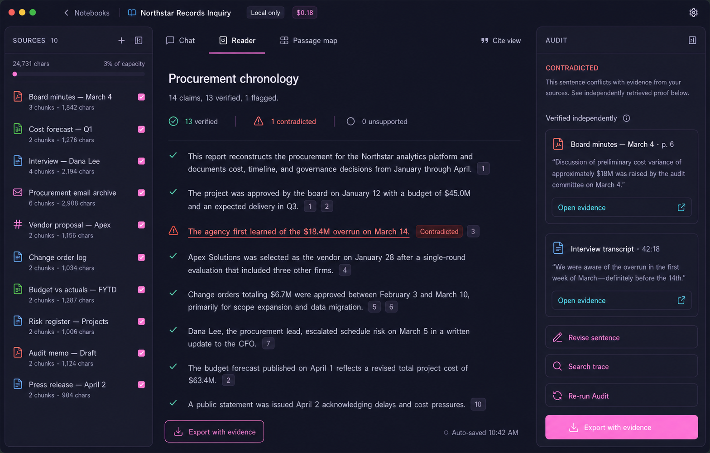

The finished report stays central and readable while sentence-level verdicts
remain restrained. The contextual rail becomes the Audit, showing independently
retrieved evidence and the exact contradiction.

**Tests:** whether Audit is legible without turning prose into a status
dashboard; how much evidence belongs in the rail; whether “Export with evidence”
feels like a professional deliverable.

### 2. The Living Case File

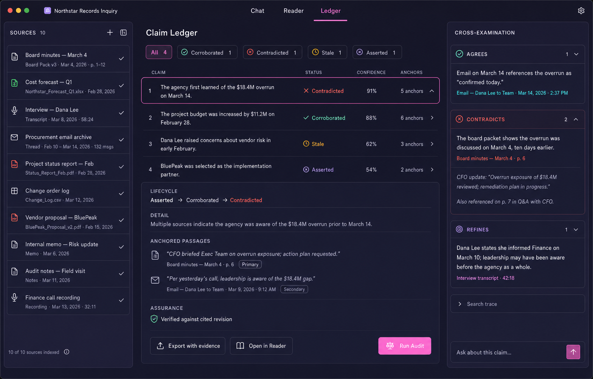

Ledger becomes a third primary mode beside Chat and Reader. Claims are flat,
dense rows with explicit lifecycle state, confidence, and evidence anchors.
Cross-Examination reuses the right rail for agreeing, contradicting, and refining
passages.

**Tests:** whether claims deserve first-class navigation; whether professionals
prefer row density over a prose feed; what belongs in the ledger versus the
contextual rail.

### 3. The Morning Desk

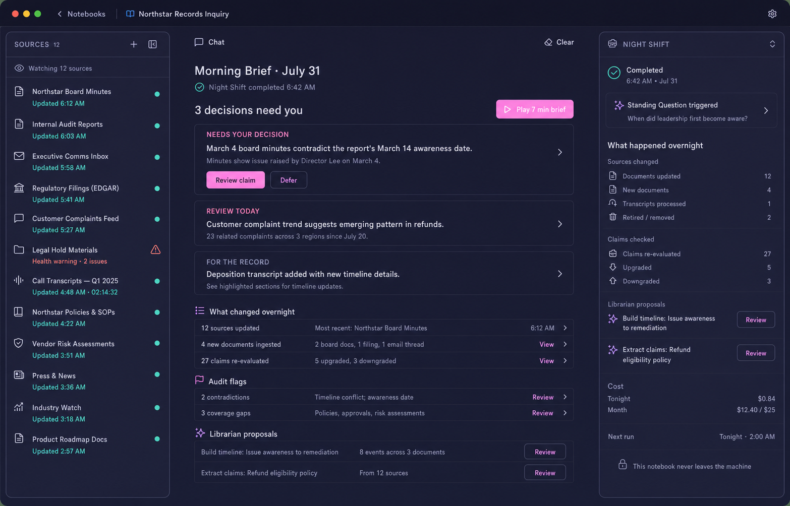

The Morning Brief ranks overnight findings by the decisions that need a human.
The Night Shift rail exposes just enough activity, cost, scheduling, and enforced
local-only routing to build trust without becoming an operations console.

**Tests:** whether the Brief should become the default daily entry point; whether
decision ranking beats chronology; how prominent the audio edition should be.

## Steward persona moments

[Open the Steward persona comparison](steward-persona-mockups.html).

### 4. Before stand-up

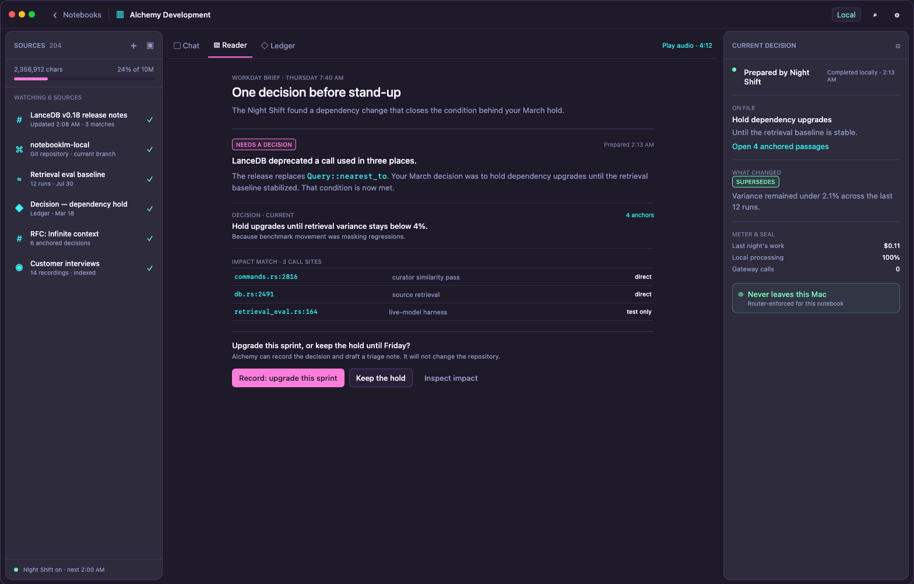

Night Shift reconnects a new dependency change to the exact decision that held
the upgrade, then asks for one bounded human judgment before stand-up.

**Tests:** whether Steward feels proactive without pretending to edit the
repository; whether a prior decision is more useful than a generic change
summary; whether authority boundaries remain visible at the moment of action.

### 5. The $49 difference

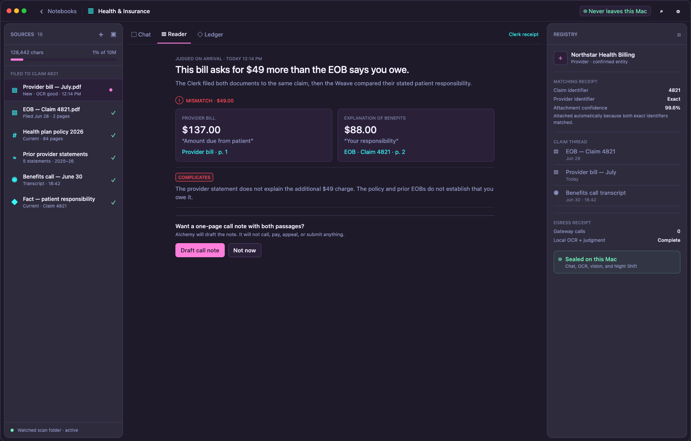

The same product grammar moves into a personal notebook: the Clerk files a bill,
the Weave connects it to the matching EOB, and Alchemy surfaces the discrepancy
without turning the workspace into a finance dashboard.

**Tests:** whether the whole-life thesis feels credible; whether provenance and
local-only routing make sensitive material feel appropriately handled; whether
the discrepancy is understandable at a glance.

### 6. Pick up the thread

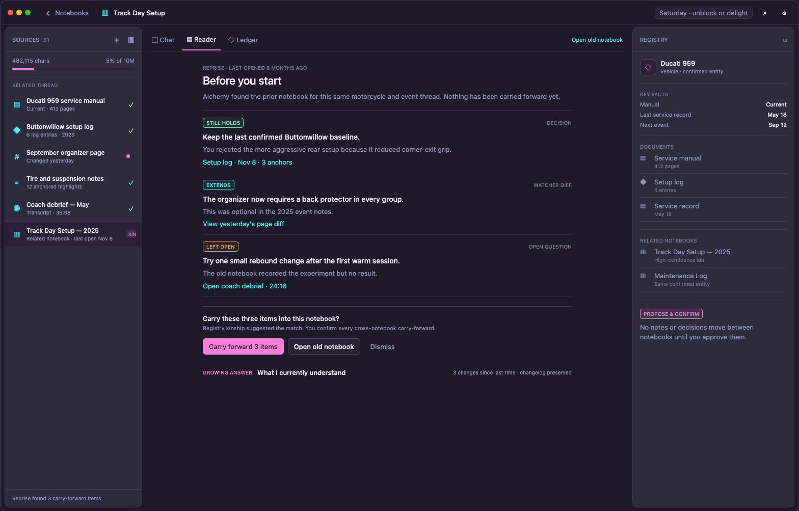

Reprise notices that a newly opened notebook is kin to dormant work, then
proposes three bounded carry-forwards: a decision that still holds, a source
change, and an unresolved question.

**Tests:** whether continuity should be a first-class return state; whether a
proposed carry-forward feels useful without silently merging notebooks; whether
the user can confirm each item independently.

## RFC-grounded surfaces

[Open the RFC surface comparison](steward-rfc-mockups.html).

### 7. Reports after close — Night Shift v1

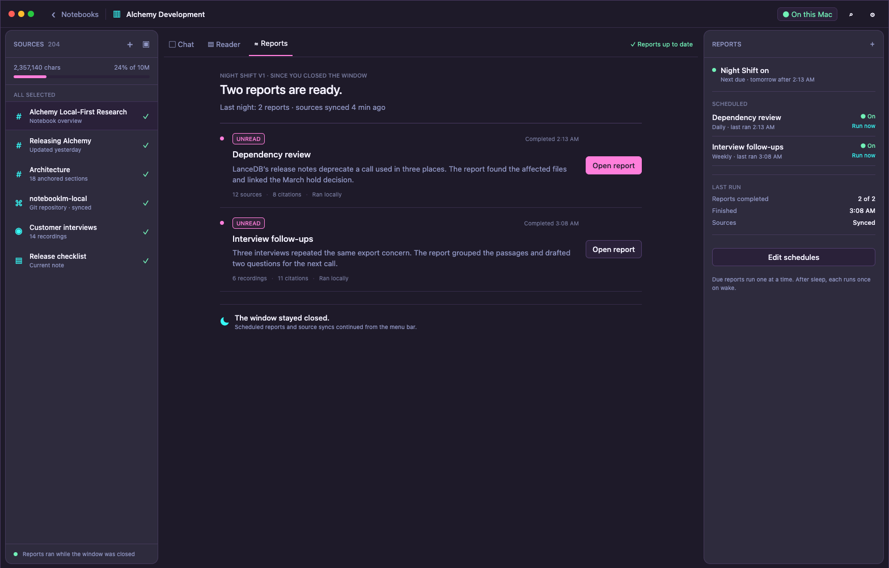

The first morning after close-to-tray: two unread scheduled reports are ready,
source sync is fresh, and the Reports rail keeps scheduling and run history
quietly visible.

**Tests:** whether the v1 handoff clearly proves that work continued after the
window closed; whether unread reports and schedules are enough without adding
watchers, budgets, or a new Brief surface; whether “Run now” belongs beside the
feed.

### 8. Residency controls — Night Shift v1

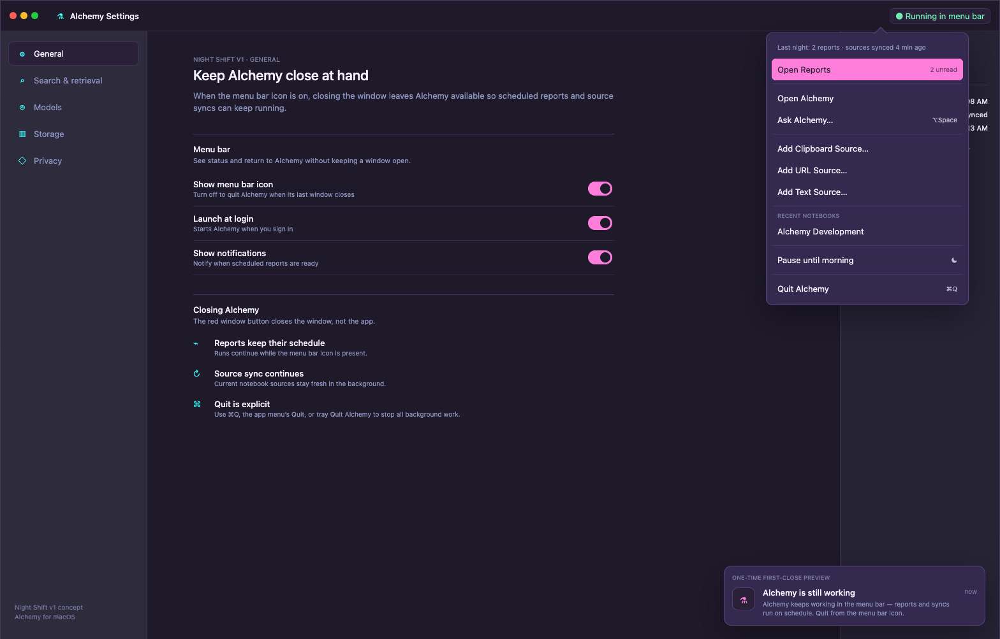

General settings, the native menu-bar surface, and the one-time notification
explain the close-versus-quit contract. Pausing stops report runs until morning
while source sync continues.

**Tests:** whether the app’s resident behavior is understandable before the
first close; whether launch-at-login can default on without feeling surprising;
whether pause, resume, and explicit quit are discoverable in one compact menu.

### 9. Home · Staff — full V12 target state

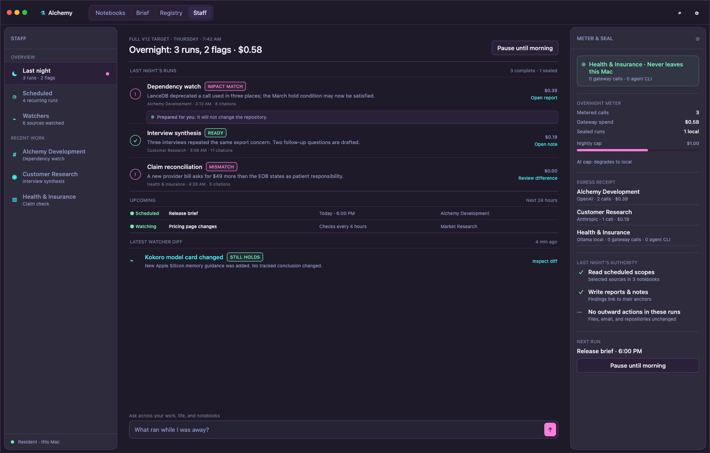

The Staff section of Home treats resident work as human-readable output rather
than as a background process monitor. Flat rows show overnight outputs, upcoming
runs, and the latest watcher diff; Meter & Seal keeps cost, routing, and
authority visible in the contextual rail while the unified ask box remains
available. Notebooks remains the default Home section.

**Tests:** whether Staff earns a top-level place beside Notebooks, Brief, and
Registry; whether the page stays human-centered at cross-notebook scale; whether
cost and authority are legible without becoming KPI cards.

## Night Shift as an area (10–12)

A probe past the shipped Staff sidebar: Night Shift promoted to a third
top-level area beside Notebooks and Registry — the sidebar is the staff's
timesheet, the area is the desk you leave instructions on. Three screens, one
per part: Tonight (commissioning), Standing orders (authoring), The record
(receipts). Generated with codex ImageGen against 09 as the strict style
reference; prompts in [PROMPTS.md](PROMPTS.md).

### 10. Tonight — the commissioning desk

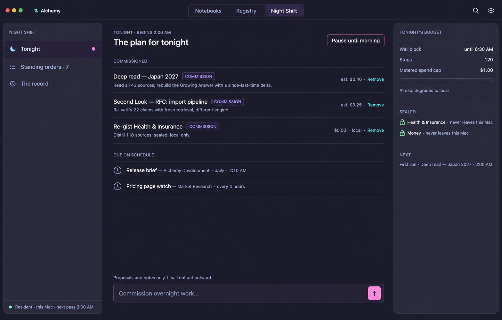

The missing verb: one-off overnight jobs handed to the resident staff before
bed. Commissions queue beside the recurring work already due; the budget rail
holds wall-clock, steps, and a spend cap that degrades to local; sealed
notebooks stay visibly sealed.

**Tests:** whether "commission overnight work" reads as an ask-box twin rather
than a job queue; whether estimates and Remove are enough control; whether the
propose-never-act line belongs at the point of commissioning.

### 11. Standing orders — the cross-notebook index

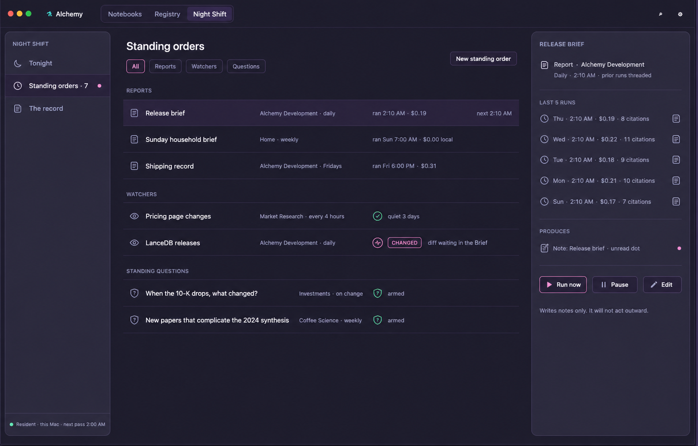

Reports, watchers, and standing questions as first-class objects in one place,
each with cadence, last run, cost, and next fire; the selected order's detail
(run history, what it produces, Run now / Pause / Edit) rides the contextual
rail.

**Tests:** whether standing orders deserve authoring outside their notebooks;
whether three kinds share one index cleanly; how much run history the rail can
carry before it becomes an admin console.

### 12. The record — receipts, not monitoring

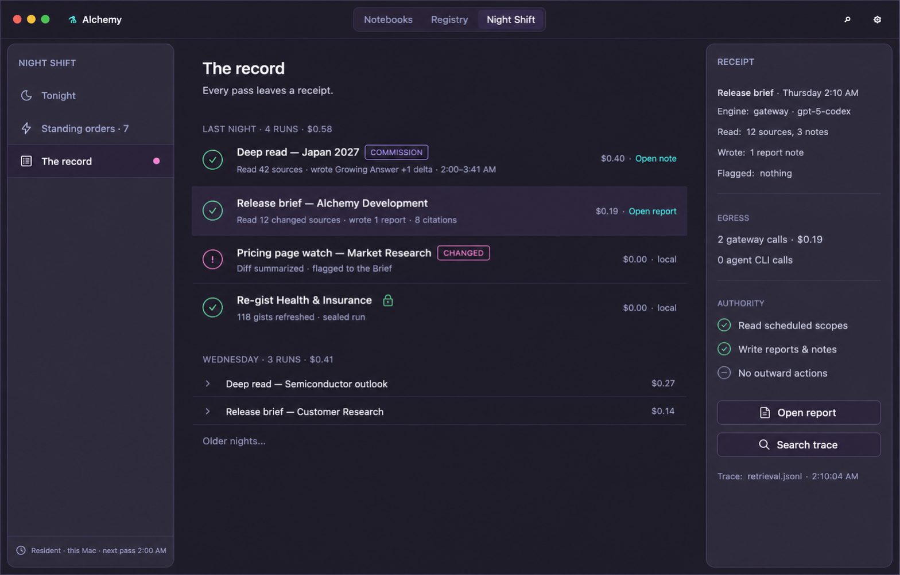

Every pass leaves a receipt: what was read, written, flagged, and spent,
grouped by night. The rail shows one receipt in full — engine, egress,
authority, trace pointer. Morning-after review, never live ops.

**Tests:** whether receipts build enough trust to justify overnight autonomy;
whether egress and authority belong on every receipt or only metered ones;
whether this absorbs Meter & Seal from Settings.

## Shared design invariants

- Preserve Alchemy’s narrow navigator, unboxed center “paper,” and floating
  contextual rail.
- Use the existing Synthwave ’84 palette, typography density, border treatment,
  and compact monochrome chrome.
- Pair every semantic color with an icon and text.
- Keep one believable work moment per screen instead of showing every V12
  capability at once.
- Keep Night Shift v1 distinct from staged watcher, budget, Brief, and standing
  question concepts.
- Avoid teams, avatars, admin controls, cloud-agent dashboards, knowledge graphs,
  retrieval knobs, and autonomous outbound actions.

## Recommendation

Lead the whole-life Steward thesis with **The $49 difference**. Use **Reports
after close** as the first shippable Night Shift story. Use **Home · Staff** to
communicate the longer-term V12 architecture without implying that all of its
watchers, budgets, and cross-notebook work ship in Night Shift v1.

The source plans are [RFC: Night Shift](../RFC-night-shift.md) and [RFC: Alchemy
V12 — The Steward](../RFC-v12-steward.md). [PROMPTS.md](PROMPTS.md) records the
generation provenance for the original Instrument of Record set (01–03) only.
Screens 04–06 are renders from [the Steward persona
comparison](steward-persona-mockups.html); screens 07–09 are renders from [the
RFC surface comparison](steward-rfc-mockups.html).
